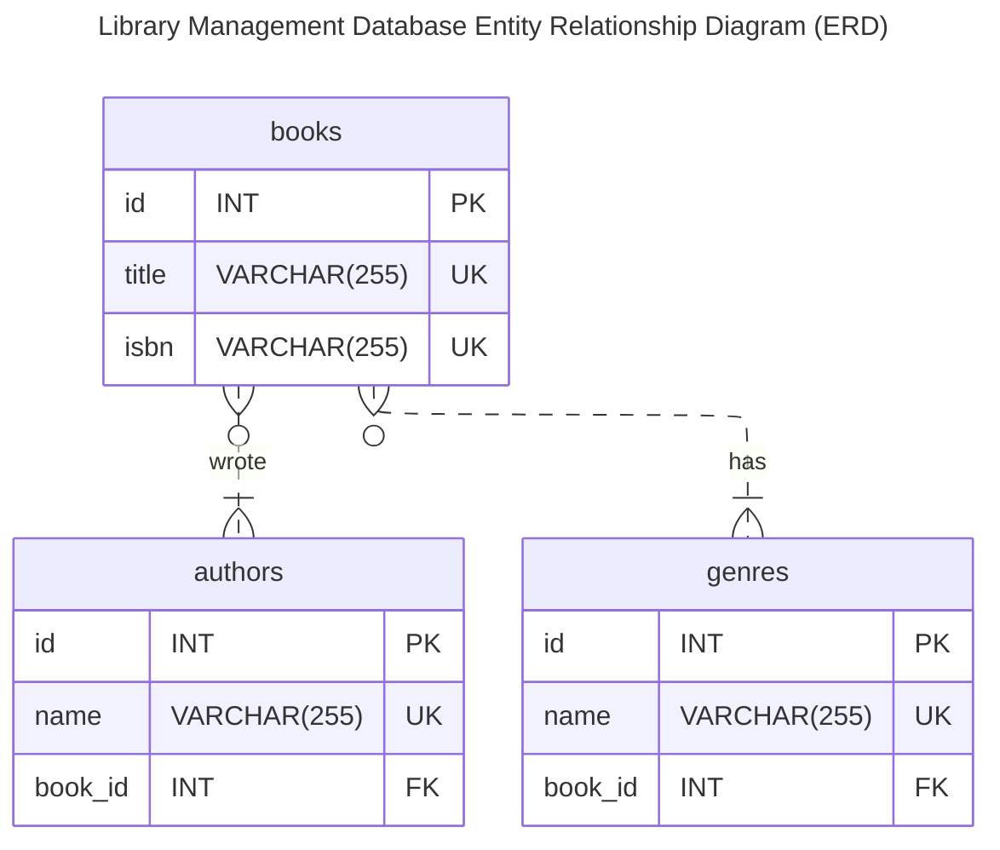

# sql-lab-library-schema

## Presentation

In this SQL lab you will **create** a minimalist **database structure** for a **library management app**.
    
The target **database** is **MySQL** (version 8.0) so you will ned to use MySQL SQLextensions.
    
The goal is to practice the DDL statements to create the database structure:
- Create the **database**, 
- Create a **user** with access to this database
- Create the **tables** and their **relationsships** (**primary keys**, required (i.e., non null) fields, **foreign keys**) 

## Lab Statement

>  Design a simplified data model for a library management application.
>  
> - Your model should allow the following information:
>
> - Book titles
> - Author (a single author per book)
> - Genres
>
> - Define the entities
> - Define the associations between the tables using an identifier

#### ERD Diagram

I created the below **ERD (Entity Relation Diagram)** with [Mermaid](https://mermaid.js.org/) which is a Markdown extension with which you can create many different diagram types.  
You can create it using any text/Markdown editor, no need for a fancy (online) application.
You give a textual description of the diagram directly within your Markdown file (in this cas the README file).
Once rendered you get the diagram.
Many [tools (editor, IDE, platforms)](https://mermaid.js.org/ecosystem/integrations-community.html) suppport Mermaid, such as GitHub, GitLab, Wordpress, Slack, VsCode, Obsidian...

You too can create your own ERD diagram today, simply read this [the documentation]([ERD (Entity Relation Diagram)](https://mermaid.js.org/syntax/entityRelationshipDiagram.html)) and take a look at the code of this diagram in the README.

#### Database Schema Creation Script

TODO