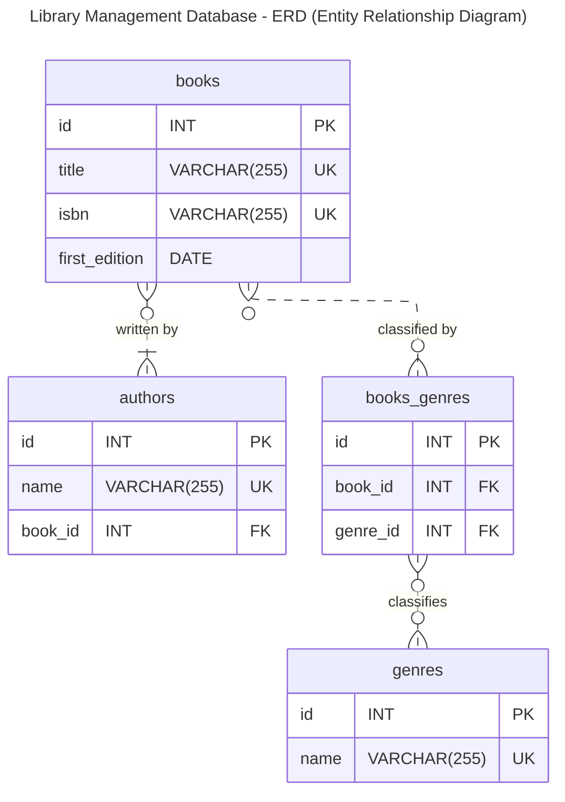

# sql-lab-library-schema

## Presentation

In this SQL lab you will **create** a minimalist **database structure** for a **library management app**.  
The target **database** server is **MySQL**.  
The goal is to practice the SQL DDL statements (Data Defintiion Language) to create the database structure:

- Create the **database**,
- Create a **user** with total access to this database
- Create the **tables** and their **relationships** (**primary keys**, required (i.e., non null) fields, **foreign keys**)

## Terminology

<dl>
    <dt>DDL</dt>
    <dd>Data Definition Language</dd>
    <dt>FK</dt>
    <dd>Foreign Key is a field of a database table (B) whose values reference a row of another table (A) via its identifier (most often the primary key of table A)</dd>
    <dt>PK</dt>
    <dd>denotes the Primary Key, a field of a database table that must be present, not null, and indexed by default to improve search performance. Each value of the primary key column identifies unambiguously the row of the table it belongs to.</dd>
</dl>

## Lab Statement

> Design a simplified data model for a library management application.
>
> - Your model should allow the following information:
>
>   - Book
>     - with the fields:
>       - `title` is a string (required), will be used as a search criterion 
>       - `isbn` is a string (required),  will be used as a search criterion
>       - `first_edition` the original release date (without time nor timezone)
>     - has relationships with other entities
>       - A book has a **single** author (contrieved for the sake of this exercise).
>       - A book is classified by zero or more genres.
> - Author
>     - has a `name` string (required) and used as a search criterion
>     - An author can write zero or more books
> - Genre
>     - has a `name` which is a string (required)
>     - A genre can classify zero or more books.
> - Define the entities
> - Define the associations between the tables using an identifier

### ERD Diagram

> [!NOTE] 
> I created this **ERD (Entity Relationship Diagram)** with [Mermaid](https://mermaid.js.org/).  
> *Mermaid* is a Markdown extension that allows you to create various types of diagram
> with any text/Markdown editor.  
> There is no lock in to a costly application or online service.
> Mermaid is free and open-source.  
> And cherry on the cake, the diagram is a portion of text within a Markdown file, which brings interesting benefits.  
> You can add the diagram to your project code base and use version control to keep the diagram (documentation) in sync with the code.  
> Once rendered you get the visual diagram, some editors do it live.
> Many [tools (editor, IDE, platforms)](https://mermaid.js.org/ecosystem/integrations-community.html) **suppport** Mermaid, such as GitHub, GitLab, Wordpress, Slack, VsCode, Obsidian...

> [!TIP]
> You too can start creating your own ERD diagram today, simply read
> [the documentation](https://mermaid.js.org/syntax/entityRelationshipDiagram.html),
> and take a look at the [source code of this diagram](https://github.com/ebouchut-laplateforme/sql-lab-library-schema/blob/64dbd16d1e81a16e6f3027a6f907689a3b9dee11/README.md?plain=1#L53-L85) to get a concrete example.

### Database Schema Creation Script

TODO

